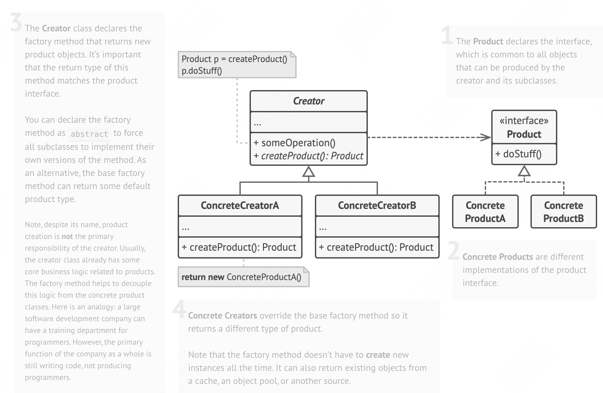

## Formal definition
> **Factory Method** is a creational design pattern that provides an interface for creating objects in a superclass, but allows subclasses to alter the type of objects that will be created.


**Factory Pattern** is used to optimize code like this:
```js
class Creator {
    create(type) {
        if (type === 'car') console.log('make car')
        if (type === 'ship') console.log('make ship')
    }
}

const carC = new Creator()
carC.create('car')
const shipC = new Creator()
shipC.create('ship')
```

## Structure


## Code Example
```js
interface ProductMaker {
    makeSth():void
}

class CarMaker implements ProductMaker {
    public makeSth() {
        console.log('make car')
    }
}

class ShipMaker implements ProductMaker {
    public makeSth() {
        console.log('make ship')
    }
}


abstract class Creator {
    abstract getMaker(): ProductMaker

    public create() {
        this.getMaker().makeSth()
    }
}

class CarCreator extends Creator {
    public getMaker() {
        return new CarMaker()
    }
}

class ShipCreator extends Creator {
    public getMaker() {
        return new ShipMaker()
    }
}

const carC = new CarCreator()
carC.create()
const shipC = new ShipCreator()
shipC.create()
```
