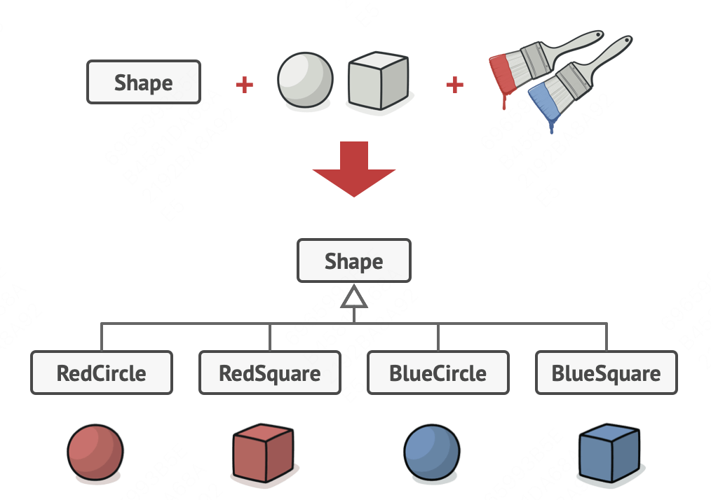
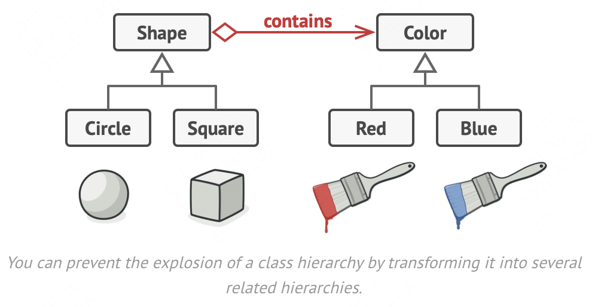
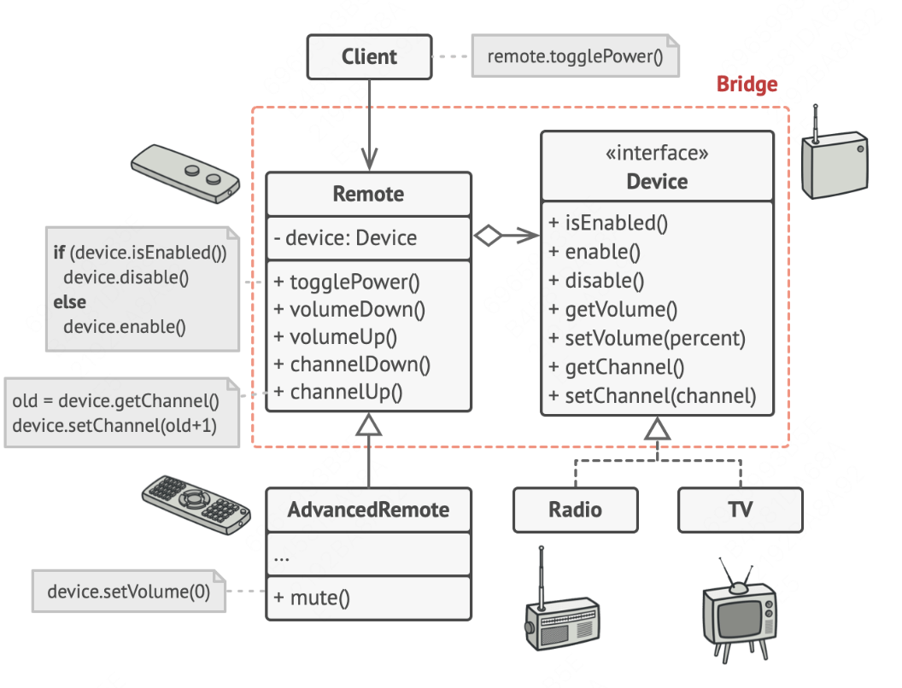

## Background
Say that you have a `Shape` class with two subclasses: `Circle` and `Square`. One day you want to extend the class to incorperate colors, then you plan to create `Red` and `Blue` subclasses, since you already have two subclasses, you'll need to create four subclasses such as `RedCircle`, `RedSquare`, then the structure would be like this: 

Using bridge you can change the structure to this:


## Introduction
**Bridge** is a structural design pattern that divides business logic or huge class into separate class hierarchies that can be developed independently.  
There comes two parts with `Bridge`: `Abstraction` and `Implementation`. **`Abstraction`** is a high-level control layer for some entity. This layer isn’t supposed to do any real work on its own. It should delegate the work to the **`implementation`** layer (also called platform).
> One of these hierarchies (often called the Abstraction) will get a reference to an object of the second hierarchy (Implementation). The abstraction will be able to delegate some (sometimes, most) of its calls to the implementations object. Since all implementations will have a common interface, they’d be interchangeable inside the abstraction.


## Real-life Analogy


## Pseudocode

```js
// Abstraction
class Remote {
    device: Device
    constructor(device: Device) {
        this.device = device
    }
    public channelUp() {
        this.device.setChannel(this.device.getChannel() + 1)
        
    }
    public channelDown() {
        this.device.setChannel(this.device.getChannel() - 1)
    }
    public volumeUp() {
        this.device.setVolume(this.device.getVolume() + 1)
    }
    public volumeDonw() {
        this.device.setVolume(this.device.getVolume() + 1)
    }
}

class TvRemote extends Remote {
    device!: Tv
    constructor(device: Tv) {
        super(device)
    }
    mute() {
        this.device.mute()
    }
}

class RadioRemote extends Remote {}

// Implementation
interface Device {
    getChannel(): number 
    setChannel(num: number): void
    getVolume(): number
    setVolume(num: number): void
    mute?(): void
}

class Tv implements Device {
    getChannel() {
        return 0
    }
    setChannel() {}
    getVolume() {
        return 0
    }
    setVolume() {}
    mute() {}
}

class Radio implements Device {
    getChannel() {
        return 0
    }
    setChannel() {}
    getVolume() {
        return 0
    }
    setVolume() {}
}

// 调用
function client() {
    const tv = new Tv()
    const tvRemote = new TvRemote(tv)
    tv.mute()
}

client()
```

