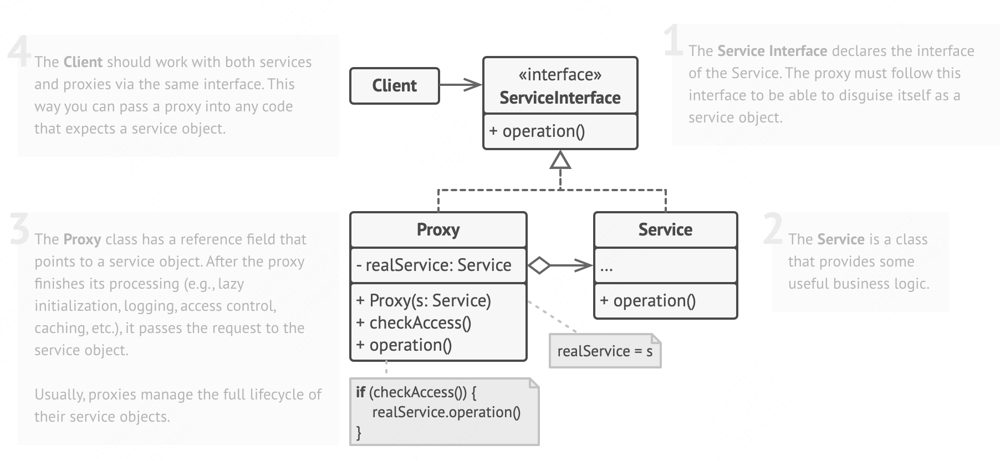
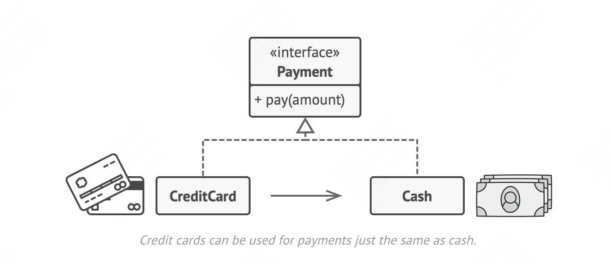

## Background
Imagine such a case, there is a third-party class which is responsible for requesting resources from a server. The client is using the third-party class to get resouces to render the page. While there are some different parts which are requesting the same resouces, then it creates redundant requests. How to solve it?  Using `Proxy`.

The `Proxy pattern` suggests that you create a **new proxy class with the same interface as an original service object**. Then you update your app so that it passes the proxy object to all of the original object’s clients


## Introduction

`Proxy` is a structural design pattern that lets you provide a substitute or placeholder for another object.

Here is the structure:


## Real-life Analogy



## Pseudocode
```js
type ID = number | string

interface ThirdPartyVideoLib {
    listVideos(): any
    getVideoInfo(id: ID): any
    downloadVideo(id: ID): void
}

class YouTubeVideoLib implements ThirdPartyVideoLib {
    listVideos() {
        // list videos
    }

    getVideoInfo(id: ID) {
        // get video info
    }

    downloadVideo(id: ID) {
        // download video
    }
}

class ProxyYouTubeVideoLib implements ThirdPartyVideoLib {
    service: ThirdPartyVideoLib
    cachedList: null | Array<any>
    constructor(service: ThirdPartyVideoLib) {
        this.service = service;
        this.cachedList = null
    }

    listVideos() {
        if (this.cachedList) return this.cachedList;
        this.cachedList = this.service.listVideos();
        return this.cachedList;
    }

    getVideoInfo(id: ID) { 
        const video = this.cachedList && this.cachedList.find((list: any) => list.id === id);
        if (video) return video;
        return this.service.getVideoInfo(id);
    }

    downloadVideo(id: ID) {
        this.service.downloadVideo(id);
    }
}
```