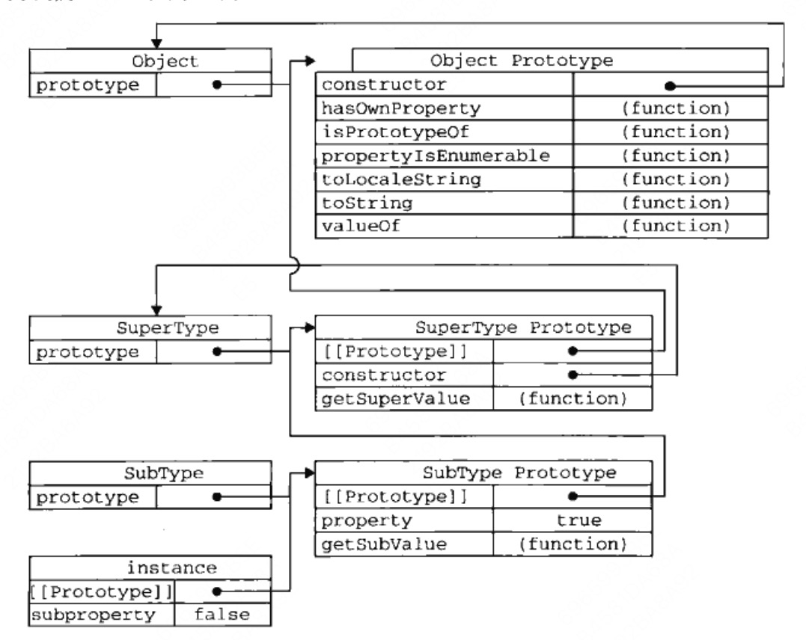

## 理解对象

### 对象的创建
```js
// **方法一**
let obj = new Object();
obj.name = 'Kayden';
obj.age = 21;
obj.sayHello = () => {alert('Hello')};
// **方法二**
let obj = {
    name: 'Kayden',
    age: 21,
    sayHello: () => {alert('Hello')}
}
```
### 对象的属性类型

## 创建对象

### 工厂模式
>英文解释: Fatory Pattern is a creational pattern that uses fatory function to create object, a factory function is a function returns a object.

**例子**
```js
function createPerson(name, age) {
    let obj = new Object();
    obj.name = name;
    obj.age = age;
    return obj;
}
let person = createPerson('Kayden', 27);
```
### 构造函数模式
>英文解释： constructor pattern uses a constructor function to create new objects.

**例子**
```js
function Person(name, age) {
    this.name = name;
    this.age = age;
}
let person = new Person('Kayden', 27);
```
使用`new`操作符时会实际会经历以下4个步骤:
1. 创建一个空对象
2. `this`指向这个空对象
3. 执行函数中的代码
4. 将这个空对象的引用返回
### 原型模式
创建的每个函数都有一个prototype属性，这个属性是一个指针，指向一个函数的原型对象，所有调用这个构造函数生成的实例都会有这个原型对象的属性和方法。
默认该构造函数的原型对象只包含一个`constructor`属性，该属性指向原构造函数，即: 
`function Person(){};Person.prototype.constructor === Person`(返回`true`),
其它方法都是从`Object`继承而来

**例子**
```js
function Person() {}
Person.prototype.name = 'Kayden';
Person.prototype.age = 27;
const person = new Person();
console.log(person.name);
```

提到原型，需要介绍几个关于原型的操作:
- `hasOwnProperty`: 检测一个属性存在实例中，还是存在原型中，存在实例中返回`true`
```js
function Person() {}
Person.prototype.name = 'Kayden';
Person.prototype.age = 27;
const person = new Person();
person.hasOwnProperty('name') // 返回false
person.name = 'Barry';
person.hasOwnProperty('name') // 返回true
```
- `in`: 对象存在某个属性时返回`true`, 无论该属性在原型上还是在实例上
```js
function Person() {}
Person.prototype.name = 'Kayden';
Person.prototype.age = 27;
const person = new Person();
'name' in person // 返回true
person.name = 'Barry';
'name' in person // 返回true
```
- `Object.getOwnPropertyNames()`: 获得对象的所有属性，无论是否可枚举，不包含原型上的
```js
function Person(){}
Object.getOwnPropertyNames(Person) // ['length', 'name', 'arguments', 'caller', 'prototype']
```
- `Object.keys()`: 返回对象的所有可枚举属性，不包含原型上的
```js
function Person(){}
Person.prototype.name = 'Kayden';
const person = new Person();
Object.keys(person); // []
```
- `for...in`: 返回对象上的所有可枚举属性，包含原型上的
```js
function Person(){}
Person.prototype.name = 'Kayden';
const person = new Person();
for (let key in person) {console.log(key)}; // 打印出 name
```
- `instanceof`: 判断一个对象是否是某个构造函数的实例，左边是对象，右边是构造函数
```js
const obj = new Object();
obj instanceof Object; // 返回true
```
- `Object.isPrototypeOf()`: 和`instanceof`作用一样，判断左侧的构造函数是否是右侧括号内实例原型
```js
const arr = new Array();
Array.prototype.isPrototypeOf(arr) // 返回true
```


## 继承
### 原型链
所谓的继承就是指实例会继承原型对象的方法，了解继承首先要了解原型链，了解原型链首先需要知道**构造函数**、**实例**以及**原型对象**这三者之间的关系：
1. 每个**构造函数**都有一个`prototype`属性，该属性是一个指针，指向**原型对象**
2. **原型对象**上有一个`constructor`属性，该属性指向该**构造函数**
3. 实例有一个无法访问的`[[Prototype]]`属性，该属性指向**构造函数**的**原型对象**

下面手动实现一个原型链继承：
```js
function SuperType() {
    this.property = true;
}
SuperType.prototype.getSuperVal = function() {
    return this.property;
}
function SubType() {
    this.subProperty = false;
}
SubType.prototype = new SuperType();
SubType.prototype.getSubVal = function() {
    return this.subProperty;
}
const instance = new SubType();
console.log(instance.getSuperVal()); // true
```
下图是完整原型链的展示：


### 构造函数方式继承
构造函数方式继承是直接在子类型构造函数里面调用父类型构造函数来实现对父类型构造函数属性和方法的继承，以下是借用构造函数加成的实现：
```js
function SuperType(name) {
    this.name = name;
}
function SubType(name, age) {
    SuperType.call(this, name);
    this.age = age;
}
SubType.prototype.sayPersonInfo = function() {
    console.log(`${this.name} is ${this.age} years old`)
}
const instance = new SubType('Kayden', 27);
instance.sayPersonInfo()
```
### 组合继承
组合继承是指将原型链和构造函数方式的方法组合到一起，发挥二者之长的一种继承模式，背后的思路通过原型链实现对原型属性和方法的继承，再通过构造函数实现对实例属性和方法的继承，以下为代码示例：
```js
function SuperType(name) {
    this.name = name;
};
SuperType.prototype.sayName = function() {
    console.log(this.name);
}
function SubType(name,age) {
    SuperType.call(this, name);
    this.age = age;
}
SubType.prototype = new SuperType();
SubType.prototype.sayAge = function() {
    console.log(this.age);
}
const instance = new SubType('Kayden', 12);
instance.sayName();
```

### 原型式继承
利用一个临时性的空构造函数，继承想要继承的对象，再临时性的返回该空构造函数的实例,该原理也及`Object.create()`的原理，以下为原型式继承的实现：
```js
function createOject(o) {
    function F() {};
    F.prototype = o;
    return new F();
}
```

### 寄生式继承

### 寄生组合式继承
采用组合式继承的缺点就是父构造函数需要调用两遍，同时在子类型的原型上定义了多余的属性(当将子类构造函数的原型指向父构造函数的实例时)，通过寄生组合式则不会有这种情况，以下为寄生组合式代码的实现：
```js

```
